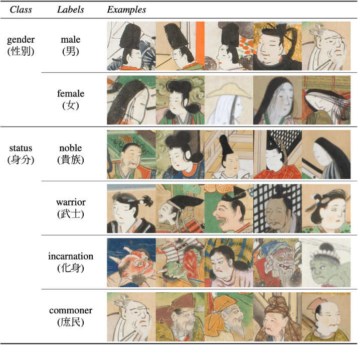
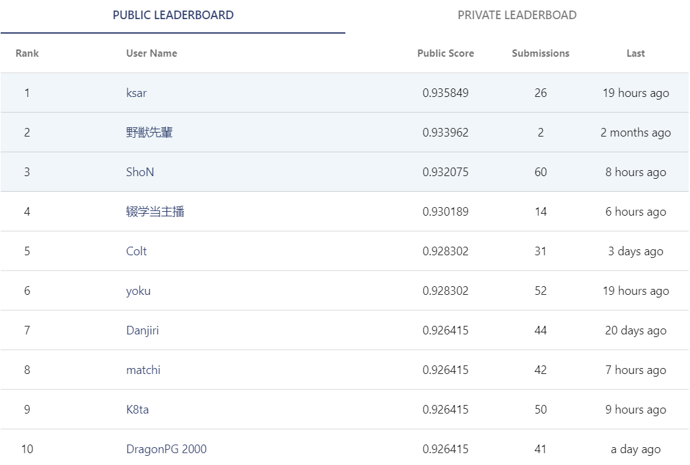
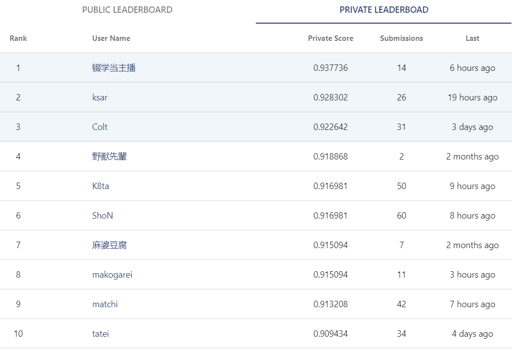

- Attention please: 

- **If you want to reprint my article, please mark the original address and author(刘书裴).**

- **If you are puzzled about a certain part or have some better suggestions, you can contact me: [3017218062@tju.edu.cn]()/[1005968086@qq.com]()**

- **If my blog has some mistakes, I'm so sorry!**

- **Thanks for watching!**

| item | tool |
| :---: | :---: |
| image | mspaint |
| formula | Online LaTeX Equation Editor |
| language | python3.7 |
| date | 2020.7.3 |
| author | 刘书裴 |

# Directory

1. [Contest analysis](#1)
2. [Data overview](#2)
3. [Model selection](#3)
4. [Model fitting](#4)
5. [Model voting](#5)
6. [Useless operations](#6)
7. [Contest scores](#7)

# Contest analysis
<a id="1"/>



It's a multi-label classification problem, including gender and status.

Thus we need to experiment with multi-label and single-label to check the effect.

# Data overview
<a id="2"/>

- Looking at the above pictures, there is an obvious result that this is a fine grained classification because of the large distance between some samples of similar class and small distance between some samples of dissimilar class.
    - We need a complex model.

- Count the images. 1: 1294, 0: 1210, 4: 834, 2: 375, 3: 371, 7: 100, 6: 53, 5: 1. It's also an imbalanced classification.
    - We need to oversample the minority class. I choose NO.6 and NO.7 class.

# Model selection
<a id="3"/>

I test some pretrained models(InceptionResNetV2/DenseNet121/EfficientNetB4/SeResNeXt50).The EfficientNetB4 and SeResNeXt50 have done well.

# Model fitting
<a id="4"/>

| item | detail |
| :---: | :---: |
| resolution | 256*256 |
| model | efficientnet-b4(pretrained)/seresnext50(pretrained) |
| optimizer | adam(1e-3) |
| lr strategy | warm up + cosine decay |
| loss | focal loss(alpha=1, gamma=2) |
| augment | mix up + common image processing skills |
| balanced | oversample |
| esemble | SWA + weighted voting |
| other | smooth label |

<p>Model1: Based on efficientnet-b4, 65 epochs, 24 batch size.</p>
<p>Model2: Based on seresnext50, 65 epochs, 24 batch size.</p>
<p>Model3: Based on efficientnet-b7, 65 epochs, 8 batch size.</p>

```
# Model1
_________________________________________________________________
Layer (type)                 Output Shape              Param #   
=================================================================
input_2 (InputLayer)         [(None, 256, 256, 3)]     0         
_________________________________________________________________
efficientnet-b4 (Model)      multiple                  17673816  
_________________________________________________________________
global_average_pooling2d (Gl (None, 1792)              0         
_________________________________________________________________
dense (Dense)                (None, 7)                 12551     
=================================================================
Total params: 17,686,367
Trainable params: 17,561,167
Non-trainable params: 125,200
_________________________________________________________________

# Model2
_________________________________________________________________
Layer (type)                 Output Shape              Param #   
=================================================================
input_1 (InputLayer)         [(None, 256, 256, 3)]     0         
_________________________________________________________________
model (Model)                (None, 8, 8, 2048)        25579120  
_________________________________________________________________
ge_m (GeM)                   (None, 2048)              2048         
_________________________________________________________________
dense (Dense)                (None, 7)                 14343     
=================================================================
Total params: 25,595,511
Trainable params: 25,527,287
Non-trainable params: 68,224
_________________________________________________________________

# Model3
_________________________________________________________________
Layer (type)                 Output Shape              Param #   
=================================================================
input_2 (InputLayer)         [(None, 256, 256, 3)]     0         
_________________________________________________________________
efficientnet-b7 (Model)      multiple                  64097680  
_________________________________________________________________
ge_m (GeM)                   (None, 2560)              2560      
_________________________________________________________________
dense (Dense)                (None, 2)                 5122      
=================================================================
Total params: 64,105,362
Trainable params: 63,794,642
Non-trainable params: 310,720
_________________________________________________________________
```

# Model voting
<a id="5"/>

Finally, I use 0.45\*model1+0.55\*model2 to predict the result, then use model3 to correct some mistakes(With higher pd and same pv.).

[Trust your CV.]()

# Useless operations
<a id="6"/>

- teacher-student(Pseudo label)
    - I wonder why it doesn't work well.

- cutout/augmix
    - Many pictures are hard to distinguish.

- bigger resolution than 256*256

- k-fold cv
    - It will spend so much time but get little improvement.

- ResNeSt/RegNet/DANet
    - The pretrained models are so great that the attention and groupconv have no effect.

# Contest scores
<a id="7"/>



